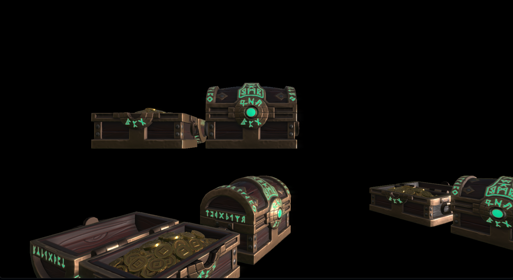

# DirectXTest
Some of my code from a project testing out rendering in DirectX

Most of the code is written by me while studying graphics programming. The goal was to learn graphics API like DirectX, learn shader programming, some engine programming and to render a 3D object with PBR.

Executable from Bin/LauncherDebug.exe

